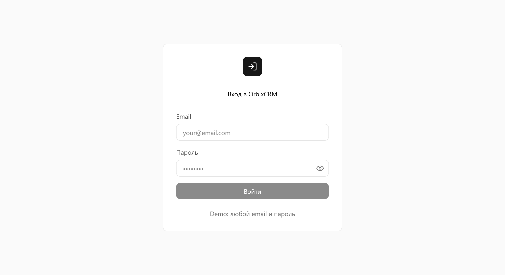
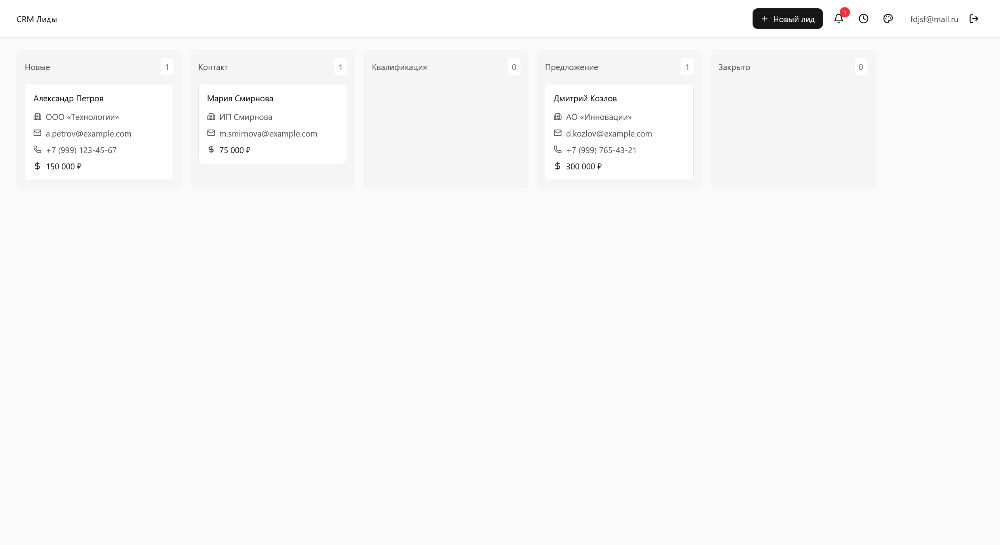

# OrbixCRM Frontend

**OrbixCRM** — это одностраничное веб-приложение (SPA) для управления продажами и лидами. В проекте реализован Frontend на React + TypeScript, с маршрутизацией на страницы авторизации и дашборда, включая канбан-доску для лидов.

---

## Содержание

- [Скриншоты](#скриншоты)
- [Описание](#описание)
- [Технологии](#технологии)
- [Установка](#установка)
- [Запуск](#запуск)
- [Структура проекта](#структура-проекта)
- [Коммиты и ветки](#коммиты-и-ветки)
- [Лицензия](#лицензия)

---

## Скриншоты





---

## Описание

Фронтенд OrbixCRM предоставляет пользователю:  

- Авторизация пользователей (с валидацией и сохранением email)
- Показ/скрытие пароля в поле ввода
- Дашборд с канбан-доской и управлением лидами
- Валидацию email и пароля на клиенте
- Адаптивный интерфейс и базовый UX/UI
- Интерактивные формы и компоненты
- Сохранение данных локально для демо

---

## Технологии

- SPA на React + TypeScript
- TailwindCSS / глобальные CSS
- Lucide Icons
- localStorage для сохранения данных пользователя
- Git/GitHub для версионного контроля
- Vite для сборки и разработки
- ESLint + Prettier для качества кода
- React Router для маршрутизации
- React Hooks для управления состоянием

---

## Установка

Склонируй репозиторий:

```bash
git clone https://github.com/TeGaLeX15/crm-minimum.git
cd crm-minimum
```

Установи зависимости:

```bash
npm install
# или
yarn install
```

---

## Запуск

Для разработки:

```bash
npm run dev
# или
yarn dev
```

Для сборки:

```bash
npm run build
# или
yarn build
```

---

## 🗂 Структура проекта

```
src/
├─ app/            # Настройки роутинга
├─ assets/         # Статические ресурсы (изображения, шрифты)
├─ auth/           # Логика авторизации
├─ components/     # Компоненты страниц
│  └─ Dashboard/   # Компоненты дашборда
│  └─ UI/          # Повторно используемые UI-компоненты
├─ hooks/          # Кастомные хуки
├─ pages/          # Страницы приложения
│  └─ Dashboard/   # Экран дашборда
│  └─ Login/       # Экран авторизации
├─ theme/          # Тема и стилизация
├─ types/          # Типы TS
├─ globals.css     # Глобальные стили
└─ App.tsx         # Точка входа
```

---

## Коммиты и ветки

- **main** — стабильная рабочая версия

**Формат коммита:**

```
<компонент>: <описание>
```

---

## Лицензия

MIT License © 2025 TeGaLeX15
